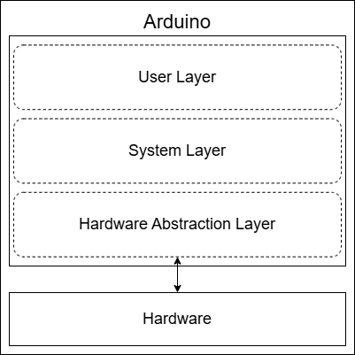
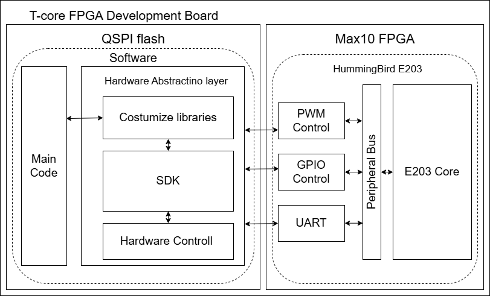

# 在基於HummingBird E203 的友晶 T-core（RISC-V）FGPA 上執行 Arduino 風格程式碼


> **文件版本**：v0.1 Draft  
> **目標平台**：友晶科技 T-core（基於 HummingBird E203／Nuclei RISC-V 核心）  


## 相關參考資源

1.Github - ArduinoCore-avr :https://github.com/arduino/ArduinoCore-avr

---

## 專案簡介
Arduino 的高階函式、範例與學習資源，讓初學者能快速完成 LED 控制、按鈕讀取與序列通訊。相較之下，如果直接在尚未具有完整工具鏈的開發平台（例如本次實做所使用的 E203 RISC-V 架構），通常需要理解暫存器位址、位元遮罩、周邊初始化與交叉編譯流程，對於不熟悉處理器的底層暫存器操作與相關硬體知識的初學者仍存在不少挑戰，若缺乏整合開發環境與完善的函式庫支援，也會使初學者難以入門。

有鑑於此，我們試圖設計一個函式庫，結合 **Arduino 的軟體設計便利性** 與 **RISC-V 架構於微處理器上的開放優勢**，讓 Arduino 程式碼在 RISC-V 微處理器上直接運行，或僅需修改少量程式碼即可執行，那麼使用者就能以熟悉的開發模式快速控制 RISC-V 平台上的硬體，不僅能降低學習門檻，亦有助於推廣 RISC-V 在教育與創客領域的應用。

本專案將這些硬體操作整理為 Arduino 風格的 API，讓使用者能把心力放在應用邏輯，同時保留 RISC-V 平台的開放性與可擴充性。

## 目錄

1. [Arduino 的運作原理](#1-Arduino-的運作原理)  
2. [如何在 T-core 上實現](#2-如何在-T-core-上實現)  
3. [已知限制與差異](#3已知限制與差異)  
4. [實作內容](#4-實作內容)  
   - 4.1 [環境設定](#41-環境設定)  
   - 4.2 [自製函式庫及底層映射](#42-自製函式庫及底層映射)  
   - 4.3 [編譯相關設定](#43-編譯相關設定)  
5. [附錄 A：腳位對應表](#附錄-A腳位對應表參考pin_T-corec)  
6. [附錄 B：常數定義](#附錄-B常數定義)  


---
## 1. Arduino 的運作原理

### 1.1 Arduino 程式結構

Arduino 程式（稱為 **Sketch**）的最小結構由兩個強制函式組成：

```cpp
void setup() {
    // 初始化：只執行一次
}

void loop() {
    // 主迴圈：持續重複執行
}
```
這個簡潔的介面背後，由 Arduino 框架隱藏了大量底層細節，包含：

- **硬體初始化**（時鐘、UART、中斷向量等）
- **C/C++ 執行環境啟動**（`.data` 段搬移、`.bss` 清零、全域建構子呼叫）
- **標準 `main()` 函式**（呼叫 `setup()` 後進入無限 `loop()` 迴圈）

### 1.2 Arduino 的分層架構
<p align="center">
  
</p>

```
┌─────────────────────────────────────┐
│         使用者 Sketch (*.ino)        │  ← setup() / loop()
├─────────────────────────────────────┤
│       Arduino 核心函式庫             │  ← pinMode / digitalWrite / Serial ...
├─────────────────────────────────────┤
│       硬體抽象層 (HAL / BSP)         │  ← 暫存器映射、驅動程式
├─────────────────────────────────────┤
│       微控制器硬體                   │  ← AVR / ARM 
└─────────────────────────────────────┘
```
Arduino 的整體運作架構可視為「抽象 API + Core + BSP（Board Support Package）」三層結構的整合。這樣的設計是為了讓 Arduino 能夠在不同處理器平台上運作，例如 AVR（ATmega328）、ARM（STM32）、ESP32...等等。其關鍵在於官方或晶片廠商會針對特定硬體提供對應的 Arduino Core，負責將高階函式如 pinMode()、digitalWrite()、analogWrite() 等對應到底層硬體暫存器的實際操作。

而 Arduino Core 會將 Arduino API 對應至 BSP（Board Support Package），而 BSP 則負責初始化處理器與外設（如 GPIO、UART、Timer 等）。在 BSP 之下，硬體抽象層（HAL, Hardware Abstraction Layer） 會進一步操作暫存器或記憶體映射區，最終由驅動程式直接控制硬體。

換言之，Arduino 函式庫的運作原理在於其高階函式庫所建立的抽象層，讓使用者僅需編寫應用邏輯程式（ 例如在 setup() 與 loop() 中操作 I/O ），而不需關心硬體差異。本研究的目標正是以相同概念為基礎，為 RISC-V 架構的 E203 微處理器設計出一套類似的抽象層函式庫，讓 Arduino 程式碼能以最少修改直接運行於該平台。


### 1.3 關鍵機制

| 機制 | Arduino (AVR/ARM) | 說明 |
|------|-------------------|------|
| 啟動程式碼 | `startup_samd21.c` / `crt0.S` | 初始化記憶體、呼叫 `main()` |
| GPIO 抽象 | `digitalWrite(pin, val)` | 將邏輯腳位編號對應至硬體暫存器 |
| UART 抽象 | `Serial.begin(baud)` | 封裝 UART 暫存器操作 |
| PWM 抽象 | `analogWrite(pin, val)` | 設定計時器/計數器產生 PWM 波形 |
| 延遲函式 | `delay(ms)` / `millis()` | 使用硬體計時器實作 |

---

## 2. 如何在 T-core 上實現

<p align="center">
  
</p>

上圖為 T-core 開發板的 MAX 10 FPGA 承載 E203 核心與相關周邊的意示圖。左邊的QSPI flash 可以給使用者燒錄如C語言等高階語言;右邊則是可燒錄如 Verilog等硬體描述語言。現在如圖所示，左邊使用者主程式透過自製函式庫及 SDK／BSP，將控制需求轉換成 GPIO、PWM 與 UART 等周邊的暫存器操作，右邊則為運作的硬體架構。


### 整體實現流程
在不使用官方 Arduino 框架的情況下，於 T-core（E203 RISC-V）上實現相容的 Arduino 風格開發，需要自行建立每一層的對應機制。

```
┌──────────────────────────────────────────────────────┐
│              使用者程式 (main.cpp)                    │
│         setup() / loop() / Arduino 風格 API           │
└──────────────────┬───────────────────────────────────┘
                   │ 呼叫
┌──────────────────▼───────────────────────────────────┐
│           自製 Arduino 相容函式庫                      │
│   wiring_digital.cpp / Serial.cpp / wiring_time.cpp   │
└──────────────────┬───────────────────────────────────┘
                   │ 存取
┌──────────────────▼───────────────────────────────────┐
│        腳位映射表 (GPIO_pinMap)                       │
│        pins_T-core.c / pins_T-core.h                  │
└──────────────────┬───────────────────────────────────┘
                   │ 操作
┌──────────────────▼───────────────────────────────────┐
│        E203 硬體暫存器 (platform.h)                   │
│        GPIO_REG / UART_REG / PWM_REG                  │
└──────────────────────────────────────────────────────┘
```
### 步驟一：建立 C++ 編譯與執行環境

在 RISC-V 裸機環境上，C++ 程式無法直接執行，需要：
1. **更改編譯工具** ：讓編譯器能配合Arduino程式碼編譯C++
2. **撰寫啟動程式碼 `start.S`**：負責設定堆疊指標、將程式碼從 Flash 複製到 ITCM（若需要）、清除 BSS 段、呼叫全域建構子，最後跳入 `main()`。
3. **撰寫初始化程式 `init.c`**：初始化 UART、設定中斷向量、提供計時器讀取函式。
4. **配置 Linker Script**：根據執行方式（Flash XIP、Flash→ITCM、ITCM）選擇對應的 `.lds` 檔案，定義各記憶體區段位址。
5. **撰寫 `Makefile`**：整合 RISC-V GCC 工具鏈，設定編譯旗標與連結選項。
### 步驟二：建立 Arduino 相容函式庫

1. **定義腳位映射表**（`pins_T-core.h` / `.c`）：將 Arduino 邏輯腳位編號對應至 E203 GPIO 編號，並記錄每支腳位支援的功能（GPIO、PWM、UART、SPI、I2C）。
2. **實作 Digital I/O API**：`pinMode()`、`digitalWrite()`、`digitalRead()` 透過腳位映射表操作對應的 GPIO 暫存器。
3. **實作 Analog/PWM API**：`analogWrite()` 設定 E203 的 PWM 計時器產生對應波形。
4. **實作 Serial API**：`Serial.begin()`、`Serial.print()` 封裝 UART0/UART1 暫存器操作。
5. **實作計時 API**：`delay()`、`millis()` 使用 E203 的 `mtime` 計時器實作。

## 3.已知限制與差異
由於 E203的設計與 Arduino 所使用的 AVR 架構還是有些微差距，在實做細節須根據E203架構做更改。

以下表格列出Arduino相關函數與實做狀況

| 項目 | Arduino 標準行為 | T-core 實作狀況 | 說明 |
|------|----------------|----------------|------|
| `analogRead()` | 讀取 ADC 值（0~1023） | 尚未實作 | E203 需外接 ADC 模組 |
| `Serial` 緩衝區 | 軟體 Ring Buffer | 依實作而定 | 高速接收可能遺漏資料 |
| `millis()` 精度 | 微秒級 | 實做完成，未測試| ---- |
| `tone()` | 產生特定頻率方波 | 尚未實作 | 可用 PWM 手動模擬 |
| 中斷 `attachInterrupt()` | 外部腳位中斷 | 尚未實作 | E203 支援 GPIO 中斷，需擴充 |
| `Wire`（I2C 函式庫） | 標準 I2C 通訊 | 尚未實作 | GPIO 14/15 有 I2C0 硬體 |
| `SPI` 函式庫 | 標準 SPI 通訊 | 尚未實作 | GPIO 2~7 / 26~31 有 SPI 硬體 |
| `.ino` 自動轉換 | IDE 自動處理 | 需手動寫 `main.cpp` | 不使用 Arduino IDE |
| 例外處理（try/catch） | 支援 | 需移除 `-fno-exceptions` | 預設關閉以縮小 binary |


## 4. 實作內容

### 4.1 環境設定
#### 4.1.1 編譯支援 C++ 的 toolchain
要讓 RISC-V 平台支援 C++ 語法編譯，需要一個支援 C++ 的編譯器工具鏈(使用或擴展 GCC 或 LLVM/Clang)。

為了確保編譯器可編譯C++ 語法，需要將`riscv-gnu-toolchain`啟用 c++ 並重新編譯。


先到目錄 /TRRV-E-SDK/work/build/riscv-gnu-toolchain 更新編譯工具鏈
```
＃安裝所有必要相依套件
sudo apt update
sudo apt install autoconf automake autotools-dev curl python3 \
libmpc-dev libmpfr-dev libgmp-dev gawk build-essential bison flex \
texinfo gperf libtool patchutils bc zlib1g-dev libexpat-dev

＃下載並設定 riscv-gnu-toolchain
git clone https://github.com/riscv-collab/riscv-gnu-toolchain
cd riscv-gnu-toolchain
./configure --prefix=/opt/riscv \
            --with-arch=rv32imac \
            --with-abi=ilp32 \
            --enable-languages=c,c++

＃編譯
make -j$(nproc)  # 多核心並行加速，請依照自己的硬體選擇
```

編譯完成後請到目錄 /riscv-gnu-toolchain/rv32-unknown-elf/prefix/bin 下檢查有無以下檔案：
- riscv32-unknown-elf-gcc → C 編譯器
- riscv32-unknown-elf-g++ → C++ 編譯器 ✅ 
- riscv32-unknown-elf-ld, objcopy, objdump, gdb 等工具

確定編譯器沒問題後請在 `~/.bashrc`裡加入以下指令
將編譯器路徑加進環境變數：
```
export PATH=[依照你的絕對路徑更改]/TRRV-E-SDK/work/build/prefix/bin:$PATH

＃記得執行 source ~/.bashrc
```

#### 4.1.2 提供裸機環境所需的 C++ 初始化支援
在 RISC-V 裸機（Bare-metal）平台上支援 C++，需要額外處理 C++ 執行環境（Runtime）的初始化，包含全域物件的建構與解構。

在友晶提供的bsp中，已經有針對C語言專案的裸機啟動邏輯與初始化機制:

| 檔案路徑                            | 功能                         | 備註                                        |
| ------------------------------- | -------------------------- | ----------------------------------------- |
| `bsp/tcore-e203/env/start.S`    | **裸機啟動碼 (crt0.S)**         | 設定 Stack Pointer、跳轉到 `main()`             |
| `bsp/tcore-e203/env/link_*.lds` | **linker script**          | 定義 `.text`, `.data`, `.bss`, RAM/Flash 對應 |
| `bsp/tcore-e203/env/init.c`     | **早期初始化邏輯**                | 包含時鐘、堆區初始化等                             |
| `bsp/tcore-e203/env/entry.S`    | 包含 `reset_vector`、中斷跳轉表等 | 有些 SDK 用這個名稱承接 `start.S`                  |
| `bsp/tcore-e203/stubs/*.c`      | **newlib 函式對應 stub**       | 像 `_sbrk()`, `_write()`, `_exit()` 等      |
| `software/libraries/`           | 類似 Arduino 的封裝 API         | 如 `wiring_analog.c` 封裝 PWM                |


### 4.2 自製函式庫及底層映射
這部份即撰寫給使用者使用的頂層函式，負責將使用者的操作對應到相關暫存器操作

***以下所有程式的目錄配置請參考附錄C。***

#### 4.2.1 腳位描述結構

為了讓上層 API 能夠透過邏輯腳位編號操作硬體，定義以下結構體作為腳位映射表的元素：

`pins_T-core.h`:

```c
typedef struct {
    uint8_t     gpio_num;       // E203 GPIO 編號（0~31）
    bool        support_gpio;   // 是否可作為外部排針使用
    bool        support_pwm;    // 是否支援 PWM 輸出
    uint8_t     pwm_channel;    // PWM 頻道編號
    uint8_t     uart_channel;   // UART 頻道編號
    uint8_t     spi_channel;    // SPI 頻道編號
    uint8_t     i2c_channel;    // I2C 頻道編號
    const char* iof0_func;      // IOF0 功能名稱
    const char* iof1_func;      // IOF1 功能名稱
    uint8_t     MODE;           // 目前設定的功能模式
    bool        digital_available;  // 是否可作數位輸入/輸出
    bool        analog_available;   // 是否可作類比輸入/輸出
    const char* REMARKS;        // 備註
} GPIO_PinDescription;
```

整張映射表宣告於 `pins_T-core.c`：

```c
#include "pins_T-core.h"


//腳位資訊結構，紀錄每個外部腳位的資訊（目前只有gpio，因此先宣告為GPIO_pinMap）
//未被定義的接腳(mode_undef == YES)無法被Read跟Write函數操控
//硬體沒有規劃的腳位support_GPIO先設成NO
GPIO_PinDescription GPIO_pinMap[] = {
//GPIO_number support_PIN support_PWM  PWM_ch   UART_ch   SPI_ch  I2C_ch    IOF0      IOF1        MODE   digit_able ana_able    REMARKS
  {	   0, 	      YES,	 YES,	0x00,  NO_UART,  NO_SPI, NO_I2C,	"", "pwm0_0",  UNDEFINED,	YES,	YES,	""},
  {	   1,         YES,	 YES,	0x01,  NO_UART,  NO_SPI, NO_I2C,	"", "pwm0_1",  UNDEFINED,	YES,	YES,	""},
  {	   2,         YES,	 YES,   0x02,  NO_UART,    0x00, NO_I2C,"spi0_cs0", "pwm0_2",  UNDEFINED,	YES,	YES,	""},
  {	   3,         YES,	 YES,   0x03,  NO_UART,    0x00, NO_I2C,"spi0_dq0", "pwm0_3",  UNDEFINED,	YES,	YES,	""},
  {	   4,         YES,	  NO, NO_PWM,  NO_UART,    0x00, NO_I2C,"spi0_dq1",       "",  UNDEFINED,	YES,	 NO,	""},
  {	   5,         YES,	  NO, NO_PWM,  NO_UART,    0x00, NO_I2C,"spi0_sck",       "",  UNDEFINED,	YES,	 NO,	""},
  {	   6,         YES,	  NO, NO_PWM,  NO_UART,    0x00, NO_I2C,"spi0_dq2",       "",  UNDEFINED,	YES,	 NO,	""},
  {	   7,         YES,	  NO, NO_PWM,  NO_UART,    0x00, NO_I2C,"spi0_dq3",       "",  UNDEFINED,	YES,	 NO,	""},
  {	   8,          NO,	  NO, NO_PWM,  NO_UART,    0x00, NO_I2C,"spi0_cs1",       "",  UNDEFINED,	YES,	 NO,	""},
  {	   9,          NO,	  NO, NO_PWM,  NO_UART,    0x00, NO_I2C,"spi0_cs2",       "",  UNDEFINED,	YES,	 NO,	""},
  {   10,         YES,	  YES,   0x20,  NO_UART,    0x00, NO_I2C,"spi0_cs3", "pwm2_0",  UNDEFINED,	YES,	YES,	""},
  {   11,         YES,	  YES,   0x21,  NO_UART,  NO_SPI, NO_I2C,	"", "pwm2_1",  UNDEFINED,	YES,	YES,	""},
  {   12,         YES,	  YES,   0x22,  NO_UART,  NO_SPI, NO_I2C,	"", "pwm2_2",  UNDEFINED,	YES,	YES,	""},
  {   13,         YES,	  YES,   0x23,  NO_UART,  NO_SPI, NO_I2C,	"", "pwm2_3",  UNDEFINED,	YES,	YES,	""},
  {   14,         YES,	  NO, NO_PWM,  NO_UART,  NO_SPI,   0x00,"i2c0_sda",       "",  UNDEFINED,	YES,	 NO,	""},
  {   15,         YES,	  NO, NO_PWM,  NO_UART,  NO_SPI,   0x00,"i2c0_scl",       "",  UNDEFINED,	YES,	 NO,	""},
  {   16,          NO,	  NO, NO_PWM,     0x00,  NO_SPI, NO_I2C,"uart0_rx",       "",  UNDEFINED,	YES,	 NO,	"pc usb"},
  {   17,          NO,	  NO, NO_PWM,     0x00,  NO_SPI, NO_I2C,"uart0_tx",       "",  UNDEFINED,	YES,	 NO,	"pc usb"},
  {   18,         YES,	  NO, NO_PWM,  NO_UART,  NO_SPI, NO_I2C,	"",       "",  UNDEFINED,	YES,	 NO,	""},
  {   19,         YES,	  YES,   0x10,  NO_UART,  NO_SPI, NO_I2C,	"", "pwm1_0",  UNDEFINED,	YES,	YES,	""},
  {   20,         YES,	  YES,   0x11,  NO_UART,  NO_SPI, NO_I2C,	"", "pwm1_1",  UNDEFINED,	YES,	YES,	""},
  {   21,         YES,	  YES,   0x12,  NO_UART,  NO_SPI, NO_I2C,	"", "pwm1_2",  UNDEFINED,	YES,	YES,	""},
  {   22,         YES,	  YES,   0x13,  NO_UART,  NO_SPI, NO_I2C,	"", "pwm1_3",  UNDEFINED,	YES,	YES,	""},
  {   23,         YES,	  NO, NO_PWM,  NO_UART,  NO_SPI, NO_I2C,	"",       "",  UNDEFINED,	YES,	 NO,	""},
  {   24,          NO,	  NO, NO_PWM, 	  0x01,  NO_SPI, NO_I2C,"uart1_rx",       "",  UNDEFINED,	 NO,	 NO,	""},
  {   25,          NO,	  NO, NO_PWM, 	  0x01,  NO_SPI, NO_I2C,"uart1_tx",       "",  UNDEFINED,	 NO,	 NO,	""},
  {   26,          NO,	  NO, NO_PWM,  NO_UART,    0x01, NO_I2C,"spi1_cs0",       "",  UNDEFINED,	 NO,	 NO,	""},
  {   27,          NO,	  NO, NO_PWM,  NO_UART,    0x01, NO_I2C,"spi1_dq0",       "",  UNDEFINED,	 NO,	 NO,	""},
  {   28,          NO,	  NO, NO_PWM,  NO_UART,    0x01, NO_I2C,"spi1_dq1",       "",  UNDEFINED,	 NO,	 NO,	""},
  {   29,          NO,	  NO, NO_PWM,  NO_UART,    0x01, NO_I2C,"spi1_sck",       "",  UNDEFINED,	 NO,	 NO,	""},
  {   30,          NO,	  NO, NO_PWM,  NO_UART,    0x01, NO_I2C,"spi1_dq2",       "",  UNDEFINED,	 NO,	 NO,	""},
  {   31,          NO,	  NO, NO_PWM,  NO_UART,    0x01, NO_I2C,"spi1_dq3",       "",  UNDEFINED,	 NO,	 NO,	""}
};
//計算結構大小
const size_t GPIO_PIN_COUNT = sizeof(GPIO_pinMap) / sizeof(GPIO_PinDescription);
```
利用pins_T-core程式來規範腳位功能和始能，透過其他函式庫引入pins_T-core來負責檢查腳位是否合理使用。

#### 4.2.2 Digital I/O

`pinMode()`、`digitalWrite()`、`digitalRead()`相關函式皆撰寫在`writing_digital`文件中。

透過查詢 `GPIO_pinMap[]` 取得對應的 GPIO 編號，再操作 E203 的 GPIO 暫存器。


#### 4.2.3 PWM 輸出（`analogWrite`）

E203 提供三組 PWM 控制器（PWM0、PWM1、PWM2），各有 4 個頻道。`analogWrite()` 需要先透過 `GPIO_pinMap[]` 確認該腳位是否支援 PWM，再設定對應的 IOF1 模式與 PWM 佔空比暫存器：

```cpp
// 虛擬碼示意，參考writing_ditigal.c的程式
void analogWrite(uint8_t pin, uint8_t value) {
    if (!GPIO_pinMap[pin].support_pwm) return; // 不支援 PWM，直接返回
    uint8_t ch = GPIO_pinMap[pin].pwm_channel;
    // 啟用 IOF1（PWM）
    GPIO_REG(GPIO_IOF_SEL) |=  GPIO_BIT(GPIO_pinMap[pin].gpio_num);
    GPIO_REG(GPIO_IOF_EN)  |=  GPIO_BIT(GPIO_pinMap[pin].gpio_num);
    // 設定 PWM 佔空比（依頻道計算暫存器位址）
    // ...（實際暫存器操作依 PWM_ch 計算）
}
```
>依照arduino core-code程式的撰寫風格（參考Github - ArduinoCore-avr），所有數位輸出的程式皆由writing_gitial程式控制，但受E203架構的編排，pwm功能使用IOF控制，會佔用原digital訊號腳位。
>因此在函式設計時考量此點，需要進一部思考如何將一般digital功能與IOF功能的切換整合成同一個函式。

**支援 PWM 的腳位**（外部排針）：

| 邏輯腳位 | GPIO 編號 | PWM 頻道 | IOF1 功能 |
|---------|-----------|---------|-----------|
| 0       | GPIO 0    | PWM0_0  | pwm0_0   |
| 1       | GPIO 1    | PWM0_1  | pwm0_1   |
| 2       | GPIO 2    | PWM0_2  | pwm0_2   |
| 3       | GPIO 3    | PWM0_3  | pwm0_3   |
| 10      | GPIO 10   | PWM2_0  | pwm2_0   |
| 11      | GPIO 11   | PWM2_1  | pwm2_1   |
| 12      | GPIO 12   | PWM2_2  | pwm2_2   |
| 13      | GPIO 13   | PWM2_3  | pwm2_3   |
| 19      | GPIO 19   | PWM1_0  | pwm1_0   |
| 20      | GPIO 20   | PWM1_1  | pwm1_1   |
| 21      | GPIO 21   | PWM1_2  | pwm1_2   |
| 22      | GPIO 22   | PWM1_3  | pwm1_3   |

#### 4.2.4 序列通訊（`Serial`）
E203 提供兩組 UART：UART0（GPIO 16/17，連接至 USB）與 UART1（GPIO 24/25）。`Serial` 類別封裝了相關操作。

#### 4.2.5 計時函式（`delay` / `millis`）

使用 E203 的 `mtime` 硬體計時器（`CLINT_MTIME`，32768 Hz 時鐘）實作


### 4.3 編譯相關設定

#### 4.3.1 記憶體佈局與 Linker Script

T-core 的記憶體空間如下：

| 記憶體區域 | 起始位址     | 大小  | 說明 |
|-----------|------------|-------|------|
| Flash     | `0x20000000` | 4 MB  | 程式碼儲存 |
| ITCM      | `0x80000000` | 64 KB | 指令緊密耦合記憶體（高速執行） |
| RAM       | `0x90000000` | 64 KB | 資料記憶體（.data、.bss、堆疊） |

根據部署需求，提供三種 Linker Script：

| Linker Script       | `DOWNLOAD` 設定 | 執行位置 | 適用情境 |
|--------------------|----------------|---------|---------|
| `link_flash.lds`   | `flash`         | ITCM    | 從 Flash 搬移程式碼至 ITCM 執行（最高效能） |
| `link_flashxip.lds`| `flashxip`      | Flash   | 直接在 Flash 上執行（XIP，節省 ITCM 空間） |
| `link_itcm.lds`    | `itcm`          | ITCM    | 程式碼直接燒錄至 ITCM（開發/除錯用） |

在 `Makefile` 中透過 `DOWNLOAD` 變數選擇：

```makefile
DOWNLOAD := flash   # 預設：Flash→ITCM 模式
```

#### 4.3.2 `common.mk` 設定

`common.mk` 是整個專案的通用編譯規則，以下列出幾個重要設定：

**工具鏈 Flags**：

```makefile
CFLAGS += -g -march=$(RISCV_ARCH) -mabi=$(RISCV_ABI) \
          -ffunction-sections -fdata-sections -fno-common
CXXFLAGS += $(CFLAGS)
CXXFLAGS += -D_GLIBCXX_USE_CXX11_ABI=1   # 強制使用 C++11 ABI
```

> `-ffunction-sections -fdata-sections` 搭配連結器的 `-Wl,--gc-sections`，可移除未被使用的函式與資料，有效縮小最終 ELF 大小。

**連結 Flags**：

```makefile
LDFLAGS += -T $(LINKER_SCRIPT)  \
           -nostartfiles        \   # 不使用預設啟動檔（我們自己提供 start.S）
           -L$(ENV_DIR) -lstdc++ \  # 連結 C++ 標準函式庫
           -Wl,--gc-sections
```

**Include 路徑**：

```makefile
INCLUDES += -I$(HEAD_DIR)                             # BSP 標頭檔
INCLUDES += -I$(DRIVER_DIR)                           # 驅動程式標頭
INCLUDES += -I$(abspath ../../software/libraries)     # 自製 Arduino 相容函式庫
INCLUDES += -I$(abspath ../../software/libraries/serial)
```

**多 `.cpp` 檔案支援**：

```makefile
CXX_SRCS  := $(wildcard *.cpp)      # 自動收集當前目錄所有 .cpp
CXX_OBJS  := $(CXX_SRCS:.cpp=.o)
LINK_OBJS := $(sort $(ASM_OBJS) $(C_OBJS) $(CXX_OBJS))
```

**完整程式可參考專案中...**


#### 4.3.3 `makefile` 設定
makefile參考以下程式碼:


#### 4.3.4 個別專案`makefile` 設定
以下以`test_gpio`演示

```makefile
Makefile copy (/test_gpio)
# 設定專案名稱，common.mk 會自動設定 TARGET = test_gpio_elf
PROGRAM = test_gpio
#TARGET = test_gpio

#--------------------------------------------------
# 設定 BSP 路徑（這個必須在 include 前）
BSP_BASE = ../../bsp


#--------------------------------------------------
## 一定要在 include 前定義這些，不然會被 common.mk 中的 := 覆蓋掉
C_SRCS += ../../software/libraries/wiring_digital.c
C_SRCS += ../../software/libraries/wiring_analog.c
C_SRCS += ../../software/libraries/pins_T-core.c


#--------------------------------------------------
## 明確列出連結的物件檔（補強 common.mk 的行為）
C_OBJS += ../../software/libraries/wiring_digital.o
C_OBJS += ../../software/libraries/wiring_analog.o
C_OBJS += ../../software/libraries/pins_T-core.o


#--------------------------------------------------
# common.mk 自動處理 test_gpio.cpp 的編譯與連結
CXX_SRCS := test_gpio.cpp


#--------------------------------------------------
# ELF = $(TARGET)_elf  # 新增這行解決無法找到 target 問題


#--------------------------------------------------
# Include paths
INCLUDES += -I$(abspath ../../software/libraries)
INCLUDES += -I$(BSP_BASE)/tcore-e203/env


#--------------------------------------------------
# 編譯參數
CFLAGS   += -O2 -fno-builtin-printf -DNO_INIT
CXXFLAGS += -O2 -fno-builtin-printf -DNO_INIT -fno-exceptions -fno-rtti
CFLAGS   += $(INCLUDES)
CXXFLAGS += $(INCLUDES)


#--------------------------------------------------
# 設定目標名稱
TARGET = $(PROGRAM)


#--------------------------------------------------
# 建構目標 (使用riscv32/64-unknown-elf需要定義)
# all: $(ELF) 
all: $(TARGET)


#--------------------------------------------------
# 最後 include，處理所有建構規則
include $(BSP_BASE)/tcore-e203/env/common.mk
```


#### 4.3.5 編譯與燒錄流程(參考)

```
原始碼 (.cpp / .c / .S)
        │
        │  RISC-V GCC 工具鏈
        │  riscv64-unknown-elf-g++
        ▼
目的檔 (.o)
        │
        │  Linker + Linker Script (.lds)
        ▼
ELF 執行檔 ($(TARGET).elf)
        │
        ├──► objcopy → Binary / HEX 燒錄檔
        │
        └──► openocd / JTAG → 燒錄至 T-core
```

**常用 Make 指令(參考)**：

```bash
# 編譯（預設 Flash 模式）
make

# 指定下載模式
make DOWNLOAD=flashxip

# 清除編譯產物
make clean

# 使用 nano specs（縮小 binary 大小）
make USE_NANO=1
```

---

## 附錄 A:腳位對應表(參考pin_T-core.c)

> T-core 外部排針（可用於 GPIO/PWM）共 20 支，特殊功能腳位不對外開放。

| 排針腳位 | GPIO 編號 | 數位 I/O | PWM | SPI | I2C | UART | 備註 |
|---------|-----------|---------|-----|-----|-----|------|------|
| 0  | GPIO 0  | ✓ | PWM0_0 | —  | —  | —  | |
| 1  | GPIO 1  | ✓ | PWM0_1 | —  | —  | —  | |
| 2  | GPIO 2  | ✓ | PWM0_2 | SPI0_CS0 | — | — | |
| 3  | GPIO 3  | ✓ | PWM0_3 | SPI0_DQ0 | — | — | |
| 4  | GPIO 4  | ✓ | —  | SPI0_DQ1 | — | — | |
| 5  | GPIO 5  | ✓ | —  | SPI0_SCK | — | — | |
| 6  | GPIO 6  | ✓ | —  | SPI0_DQ2 | — | — | |
| 7  | GPIO 7  | ✓ | —  | SPI0_DQ3 | — | — | |
| 10 | GPIO 10 | ✓ | PWM2_0 | SPI0_CS3 | — | — | |
| 11 | GPIO 11 | ✓ | PWM2_1 | —  | —  | —  | |
| 12 | GPIO 12 | ✓ | PWM2_2 | —  | —  | —  | |
| 13 | GPIO 13 | ✓ | PWM2_3 | —  | —  | —  | |
| 14 | GPIO 14 | ✓ | —  | —  | I2C0_SDA | — | |
| 15 | GPIO 15 | ✓ | —  | —  | I2C0_SCL | — | |
| 18 | GPIO 18 | ✓ | —  | —  | —  | —  | |
| 19 | GPIO 19 | ✓ | PWM1_0 | —  | —  | —  | |
| 20 | GPIO 20 | ✓ | PWM1_1 | —  | —  | —  | |
| 21 | GPIO 21 | ✓ | PWM1_2 | —  | —  | —  | |
| 22 | GPIO 22 | ✓ | PWM1_3 | —  | —  | —  | |
| 23 | GPIO 23 | ✓ | —  | —  | —  | —  | |
| 16 | GPIO 16 | — | —  | —  | —  | UART0_RX | USB 序列埠 |
| 17 | GPIO 17 | — | —  | —  | —  | UART0_TX | USB 序列埠 |
| 24 | GPIO 24 | — | —  | —  | —  | UART1_RX | 僅限 IOF |
| 25 | GPIO 25 | — | —  | —  | —  | UART1_TX | 僅限 IOF |

> **IOF 使用規則**：
> - 使用 GPIO 功能：`iof_en = 0`
> - 使用 IOF0 功能（如 UART、SPI）：`iof_en = 1, iof_sel = 0`
> - 使用 IOF1 功能（如 PWM）：`iof_en = 1, iof_sel = 1`

---

## 附錄 B:常數定義

```c
/* 數位電位 */
#define HIGH    0x1
#define LOW     0x0

/* 腳位模式 */
#define INPUT           0x0
#define OUTPUT          0x1
#define INPUT_PULLUP    0x2

/* 腳位功能模式（MODE 欄位） */
#define UNDEFINED   0x0
#define DIGITAL     0x1
#define ANALOG      0x2

/* 無對應功能的佔位值 */
#define NO_PWM   0xFF
#define NO_UART  0xFF
#define NO_SPI   0xFF
#define NO_I2C   0xFF

/* GPIO 位元遮罩 */
#define GPIO_BIT(pin)   (1 << (pin))
```


---

## 附錄 C：授權與第三方來源

本專案含不同授權的程式碼。完整授權文字及適用路徑集中於 [主要資料/LICENSE](主要資料/LICENSE)，各原始檔也保留適用的作者與授權聲明。

| 範圍 | 授權／來源 |
| --- | --- |
| 既有 SDK／BSP | 延續原有 Apache-2.0；保留原 SDK 授權文字與 SiFive 聲明 |
| `serial.cpp`、`serial.h`、`Serial0.cpp` | ArduinoCore-avr 衍生內容，LGPL-2.1-or-later；原作者 Nicholas Zambetti 及上游修改者聲明保留於檔案中 |
| `T-core_serial.hpp`、`Test/test_ROS_ERROR/time.cpp` | rosserial 衍生內容，BSD-3-Clause；保留 Willow Garage 的著作權、條件及免責聲明 |

來源參考：[ArduinoCore-avr](https://github.com/arduino/ArduinoCore-avr)、[rosserial](https://github.com/ros-drivers/rosserial)、[原 SDK 來源](https://github.com/SI-RISCV/e200_opensource)。目前來源比對使用的上游分支不代表已確認原始匯入 commit；歷史移植日期與確切版本尚待補充。

再散布或修改時，請保留適用聲明與授權全文。若另行提供含 LGPL 函式庫的執行檔，需依所採授權版本提供相應來源及符合條款的重新連結材料或機制。程式碼授權不自動套用於本文、圖片、研究文件或廠商韌體；使用另行取得的依賴時，也需遵守其授權。

## 附錄 D：發布範圍與外部依賴

公開版本採用核准的逐檔清單，並排除：

- `主要資料/bsp/tcore-e203/env/blaster_6810.hex` 及其他未核准韌體副本。
- 所有 `*.o` 物件檔及無副檔名的已編譯執行檔，包括 `test_gpio`、`test_tcore_baudrate`。
- `主要資料/software/make_log/` 的全部內容。
- 未核准的工具鏈、`work/build/` 內部產物、ROS 函式庫、其他備份及原始 PDF／PPTX 參考文件。

無副檔名的原始設定或文字文件（例如 `Makefile`、`LICENSE`）不屬於執行檔排除規則。必要的組合語言來源（例如 `crt0.s`、`start.S`、`entry.S`）仍保留。

USB-Blaster II 韌體與工具鏈需依各自授權另行取得並設定本機路徑。清單中的部分 ROS 測試，以及 UART／baudrate 範例的現有建置設定，仍引用未隨附的 `ros_lib`；相關依賴取得步驟與建置路徑尚待整理。建立下方空目錄不會安裝工具鏈、韌體或補齊 ROS 依賴。

## 附錄 E：clone 後建立空目錄

Git 不會保存空目錄。本專案不使用占位檔；clone 後，請先切換到儲存庫根目錄（可看見本 `README.md`、`assets/` 與 `主要資料/`），再執行：

```bash
mkdir -p "主要資料/work/build" "主要資料/software/test_atom"
```

| 目錄 | 用途 |
| --- | --- |
| `主要資料/work/build/` | 保留本機建置與工具安裝所使用的目錄位置；其原有內容不隨儲存庫提供 |
| `主要資料/software/test_atom/` | 保留目前尚未放入檔案的實驗目錄 |

以上是核准發布範圍內需要重建的空目錄；`mkdir -p` 也會一併建立缺少的上層 `work/`，可重複執行。被排除的 `make_log/`、工具鏈內部目錄及其他未核准目錄，不列入重建清單。
